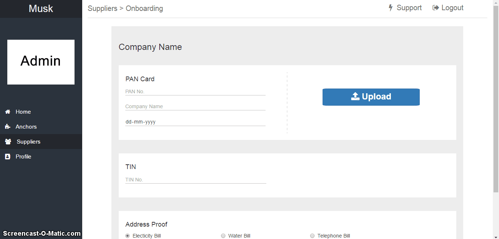
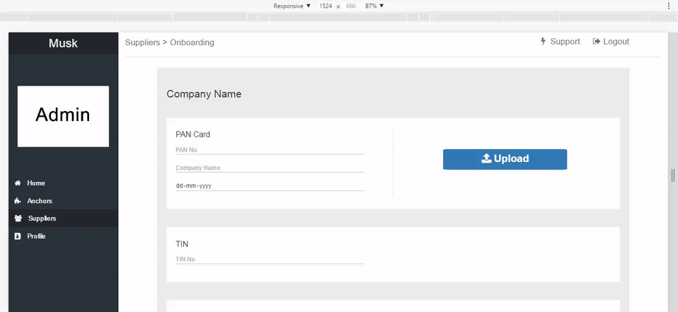

# Musk-Task
<h3>Technologies Used: </h3>
<h5>
  <ol>
    <li>Bootstrap</li>
    <li>Font Awesome</li>
    <li>jQuery</li>
  </ol>
</h5>
 
<b>Task 1:</b> To fill input field while <b>uploading a text file</b> (text file content Pan No, Name, Date). 
A dumy text file is provided in assets folder & data must always be in that format.
 
 

 
<b>Task 2: Form Validation </b>
 
 
<b>Responsiveness of Website: </b>
 
 

 

